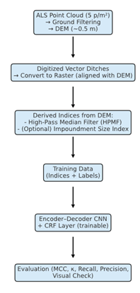

# Revised Workflow for Mapping Drainage Ditches with Deep Learning

## 1. Input Data Preparation

**Point cloud (MML, 5 p/m²):**
- Filter ALS point cloud to retain only ground returns.
- Generate a Digital Elevation Model (DEM, ~0.5 m resolution).

**Vector ditch labels (~3000 km²):**
- Convert digitized ditches into raster format aligned with DEM.
- Apply buffer (≈2–3 m, based on average ditch width).
- Optionally refine rasterization using HPMF thresholds.

## 2. Feature Layer Derivation

- Compute **High-Pass Median Filter (HPMF)** from DEM (kernel ~11).

**Optional extension:**
- Derive additional topographic indices from DEM (e.g., impoundment size index).
- Combine them with HPMF as multiband inputs.

> **Note:** DEM itself is not used directly as model input, only derived indices are.

## 3. Training Data Construction

- Split HPMF (+optional indices) and labels into tiles (e.g., 512×512 px).
- Remove tiles with <0.1% ditch pixels.
- Final dataset = paired input (indices) and label raster.

## 4. Model Development

- Encoder–decoder CNN (e.g., U-Net with Xception blocks).
- **Input:** HPMF (and optional indices).
- **Output:** pixel-wise ditch probability.
- Weighted cross-entropy loss for class imbalance.
- **CRF as the final trainable layer** to smooth discontinuities.

## 5. Evaluation & Validation

- Train/val/test split (e.g., 70/10/20%).
- Metrics: MCC, Cohen’s κ, recall, precision.
- Visual validation against reference ditch maps.
